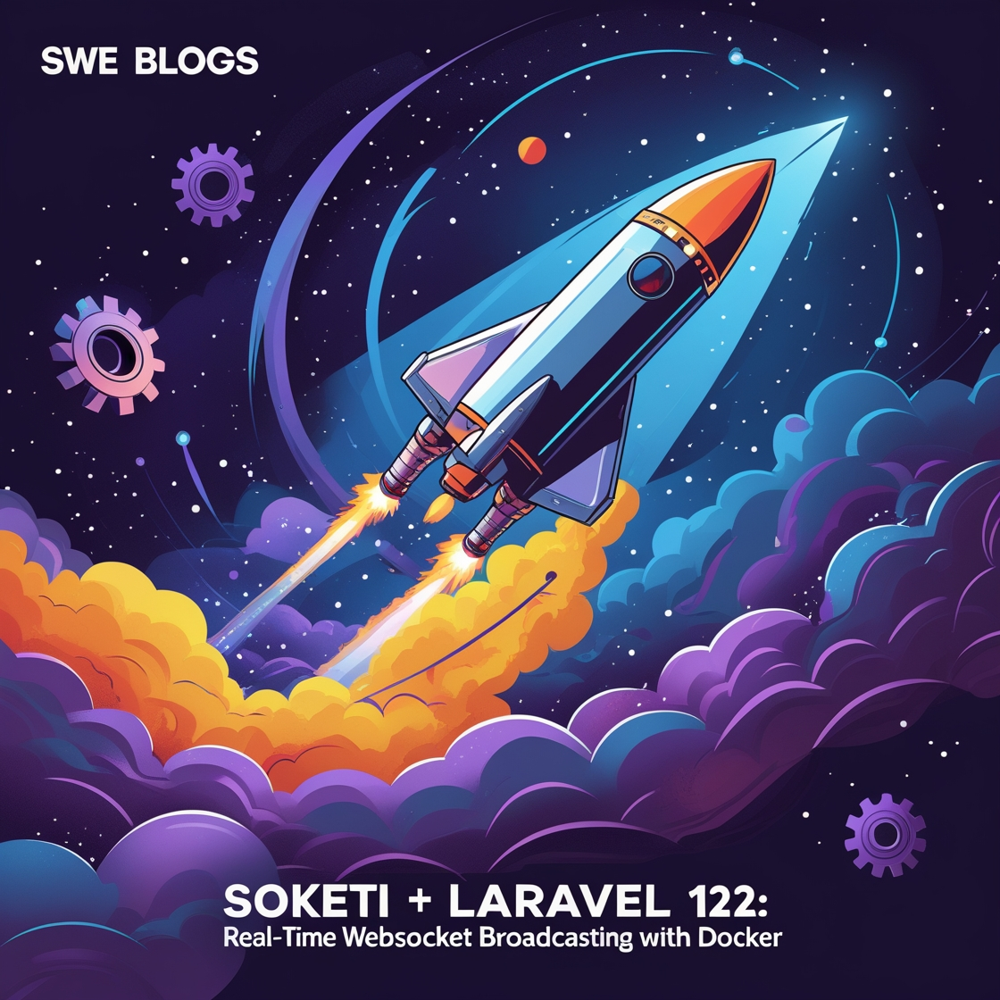
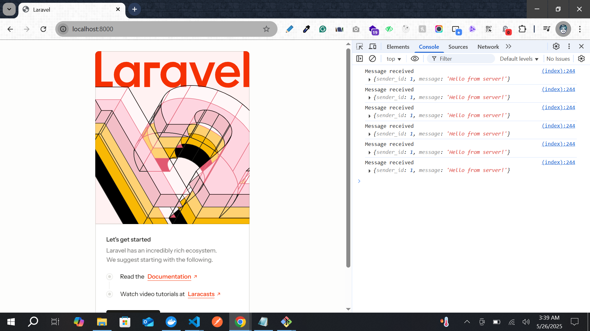
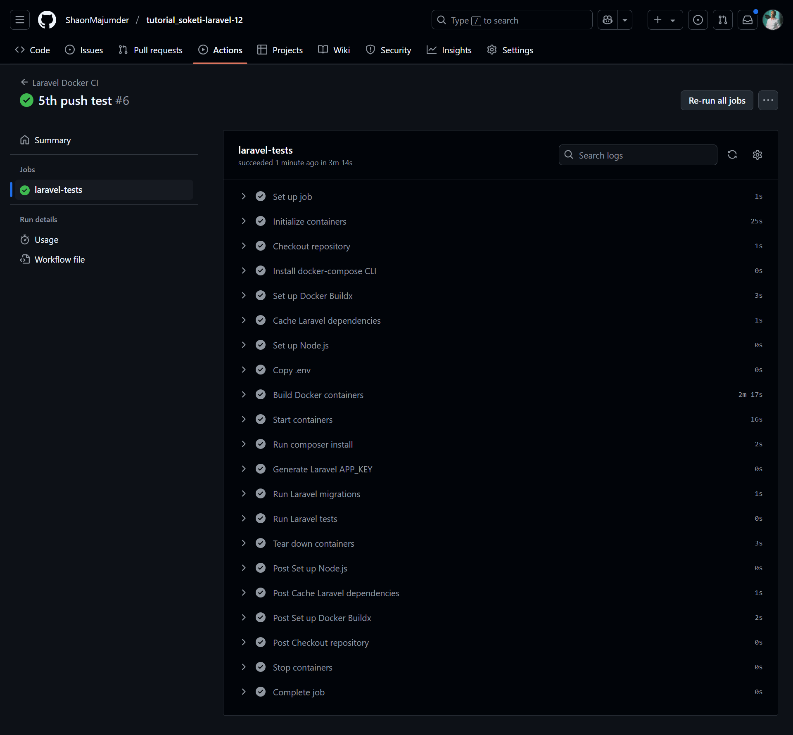

# 🧪 Soketi + Laravel 12 WebSocket Broadcasting Tutorial


This guide will help you set up a **self-hosted Soketi server** with **Laravel 12** broadcasting support using Docker.

---

## 🚀 1. Introduction

- **Soketi** is a fast, open-source WebSocket server, compatible with the Pusher protocol.
- This tutorial will cover Dockerized development, broadcasting events, frontend listening via Laravel Echo, and CI tests.

---

## 📦 2. Clone Laravel Soketi Docker Template

```bash
git clone https://github.com/ShaonMajumder/docker-template-laravel-12-php-8.3-npm-mysql-redis-nginx-queue-soketi.git tutorial_soketi-laravel-12
cd tutorial_soketi-laravel-12
```

---

## 🛠️ 3. Build and Run Docker Containers

```bash
docker-compose --env-file environment/.env up --build
```

---

## 🔍 4. Verify Soketi Server is Running

### In Browser

Visit: [http://localhost:6001](http://localhost:6001)

Expected Output:
```text
ok
```

### Inside Container

```bash
docker exec -it laravel-app bash
curl http://soketi-server:6001
```

Expected Output:
```text
ok
```

---

## 📦 5. Install NodeJS Dependencies (Vite)

```bash
npm install
npm run build
```

---

## 📡 6. Install Broadcasting in Laravel

```bash
php artisan install:broadcasting
```

### Select:
```bash
 Which broadcasting driver would you like to use? ────────────┐
 │   ○ Laravel Reverb                                           │
 │ › ● Pusher                                                   │
 │   ○ Ably  
```
- Driver: `Pusher`

```bash
 Which broadcasting driver would you like to use? ────────────┐
 │ Pusher                                                       │
 └──────────────────────────────────────────────────────────────┘

 ┌ Pusher App ID ───────────────────────────────────────────────┐
 │ 1234                                                         │
 └──────────────────────────────────────────────────────────────┘

 ┌ Pusher App Key ──────────────────────────────────────────────┐
 │ •••••••••                                                    │
 └──────────────────────────────────────────────────────────────┘

 ┌ Pusher App Secret ───────────────────────────────────────────┐
 │ ••••••••••                                                   │
 └──────────────────────────────────────────────────────────────┘

 ┌ Pusher App Cluster ──────────────────────────────────────────┐
 │ › ● mt1                                                    ┃ │
 │   ○ us2                                                    │ │
 │   ○ us3                                                    │ │
 │   ○ eu                                                     │ │
 │   ○ ap1    
```

- Select and enter these Values:
- App ID: `1234`
- Key/Secret: dummy/test values
- Cluster: Select `mt1`and press Enter
- `pusher-php-server` will be installed by default

```bash
 Would you like to install and build the Node dependencies required for br… ┐
 │ ● Yes / ○ No   

    
   INFO  Installing and building Node dependencies.


up to date, audited 98 packages in 1s

22 packages are looking for funding
  run `npm fund` for details

found 0 vulnerabilities

> build
> vite build

vite v6.3.5 building for production...
✓ 59 modules transformed.
public/build/manifest.json              0.27 kB │ gzip:  0.15 kB
public/build/assets/app-BLzl-bg6.css   33.54 kB │ gzip:  8.51 kB
public/build/assets/app-CqvyoFfN.js   114.41 kB │ gzip: 36.11 kB
✓ built in 2.09s
```

INFO : laravel-echo and pusher-js npm library will be installed by broadcasting installer.
If install fails, manually run:

```bash
npm install laravel-echo pusher-js
npm run build
```

---

## ⚙️ 7. Verify `config/broadcasting.php`

```php
'pusher' => [
            'driver' => 'pusher',
            'key' => env('PUSHER_APP_KEY'),
            'secret' => env('PUSHER_APP_SECRET'),
            'app_id' => env('PUSHER_APP_ID'),
            'options' => [
                'cluster' => env('PUSHER_APP_CLUSTER'),
                'host' => env('PUSHER_HOST') ?: 'api-'.env('PUSHER_APP_CLUSTER', 'mt1').'.pusher.com',
                'port' => env('PUSHER_PORT', 443),
                'scheme' => env('PUSHER_SCHEME', 'https'),
                'encrypted' => false, // true, revert and check
                'useTLS' => env('PUSHER_SCHEME', 'https') === 'https',
            ],
            'client_options' => [
                // Guzzle client options: https://docs.guzzlephp.org/en/stable/request-options.html
            ],
        ],
```

---

## ✉️ 8. Create and Dispatch an Event

```bash
php artisan make:event NewMessage
```

### Edit `NewMessage.php`:
```php
<?php

namespace App\Events;

use Illuminate\Broadcasting\Channel;
use Illuminate\Broadcasting\InteractsWithSockets;
use Illuminate\Broadcasting\PresenceChannel;
use Illuminate\Broadcasting\PrivateChannel;
use Illuminate\Contracts\Broadcasting\ShouldBroadcast;
use Illuminate\Foundation\Events\Dispatchable;
use Illuminate\Queue\SerializesModels;
use Illuminate\Contracts\Broadcasting\ShouldBroadcastNow;

class NewMessage implements ShouldBroadcastNow
{
    use Dispatchable, InteractsWithSockets, SerializesModels;

    public $sender_id;
    public $message;

    /**
     * Create a new event instance.
     */
    public function __construct($sender_id, $message)
    {
        $this->sender_id = $sender_id;
        $this->message = $message;
    }

    /**
     * Get the channels the event should broadcast on.
     *
     * @return array<int, \Illuminate\Broadcasting\Channel>
     */
    public function broadcastOn(): array
    {
        return [
            new Channel('message-box'),
        ];
    }

    public function broadcastWith()
    {
        return [
            'sender_id' => $this->sender_id,
            'message' => $this->message,
        ];
    }
}
```

### Test in Tinker:

```bash
php artisan tinker
```
shell will appear like this:
```bash
Psy Shell v0.12.8 (PHP 8.3.21 — cli) by Justin Hileman
>
```
Now trigger the event:
```bash
event(new \App\Events\NewMessage(1, 'Hello from server!'))
```
- output: [] - if '[]' , then it is ok.

### Check Soketi Logs:
In another terminal, immediately check log, after previously triggering the event:
```bash
docker-compose logs soketi
```

Expected Payload:
```bash
.....
 [Sun May 25 2025 19:13:33 GMT+0000 (Coordinated Universal Time)] ⚡ HTTP Payload received   

{
  name: 'App\\Events\\NewMessage',
  data: '{"sender_id":1,"message":"Hello from server!"}',
  channel: 'message-box'
}
.....
```

---

## 💡 9. Configure Frontend Listener

Edit `resources/js/echo.js`:
```js
import Echo from 'laravel-echo';

import Pusher from 'pusher-js';
window.Pusher = Pusher;

window.Echo = new Echo({
    broadcaster: "pusher",
    key: import.meta.env.VITE_PUSHER_APP_KEY,
    cluster: import.meta.env.VITE_PUSHER_APP_CLUSTER,
    forceTLS: false, //true,
    wsHost: 'localhost', //import.meta.env.VITE_PUSHER_HOST,
    wsPort: import.meta.env.VITE_PUSHER_PORT,
    wssPort: import.meta.env.VITE_PUSHER_PORT,
    enabledTransports: ["ws", "wss"],
});
```

### Modify `welcome.blade.php`, at end of before </body>:
```blade
....
        <script>
            document.addEventListener('DOMContentLoaded', function () {
                if (window.Echo) {
                    window.Echo.channel('message-box').listen('NewMessage', (e) => {
                        console.log('Message received', e);
                    });
                } else {
                    console.error('Echo is not defined');
                }
            });
        </script>
    </body>
```

---

## 🧪 10. Test Real-Time Event in Browser

- Visit: [http://localhost:8000](http://localhost:8000)
- Open browser console
- [parallaly] now in terminal inside container:
```bash
php artisan tinker
```
Shell will appear like this:
```bash
Psy Shell v0.12.8 (PHP 8.3.21 — cli) by Justin Hileman
>
```
Now trigger the event:
```bash
event(new \App\Events\NewMessage(1, 'Hello from server!'));
```
output: []

Browser Console Output:
```js
Message received { sender_id: 1, message: 'Hello from server!' }
```
See at console:


---

## ✅ 11. Create Unit Test

```bash
php artisan make:test Broadcast/NewMessageTest
```

### Edit `tests/Feature/Broadcast/NewMessageTest.php`:
```php
<?php

namespace Tests\Feature\Broadcast;

use Illuminate\Foundation\Testing\RefreshDatabase;
use Illuminate\Foundation\Testing\WithFaker;
use Tests\TestCase;
use App\Events\NewMessage;
use Illuminate\Support\Facades\Event;

class NewMessageTest extends TestCase
{
    /**
     * A basic feature test example.
     */
    // public function test_example(): void
    // {
    //     $response = $this->get('/');

    //     $response->assertStatus(200);
    // }

    public function test_event_is_broadcasted_on_correct_channel()
    {
        Event::fake([NewMessage::class]);

        event(new NewMessage(1, 'Unit test message'));

        Event::assertDispatched(NewMessage::class, function ($event) {
            return $event->sender_id === 1 &&
                $event->message === 'Unit test message' &&
                in_array('message-box', array_map(fn ($c) => $c->name, $event->broadcastOn()));
        });
    }
}
```

---

## 🤖 12. GitHub Actions CI Setup

### Create `.github/workflows/ci.yml`:
```yaml
name: Laravel Docker CI

on:
  push:
    branches:
      - main
  pull_request:
    branches:
      - main

jobs:
  laravel-tests:
    runs-on: ubuntu-latest
    services:
      mysql:
        image: mysql:5.7
        env:
          MYSQL_DATABASE: testing_db
          MYSQL_USER: testing_user
          MYSQL_PASSWORD: secret
          MYSQL_ROOT_PASSWORD: root
        # ports:
          # - 3306:3306
        options: --health-cmd="mysqladmin ping" --health-interval=10s --health-timeout=5s --health-retries=5

      redis:
        image: redis:alpine
        # ports:
        #   - 6379:6379

    env:
      DB_CONNECTION: mysql
      DB_HOST: 127.0.0.1
      DB_PORT: 3306
      DB_DATABASE: testing_db
      DB_USERNAME: testing_user
      DB_PASSWORD: secret
      CACHE_DRIVER: redis
      QUEUE_CONNECTION: redis
      REDIS_HOST: 127.0.0.1
      PUSHER_APP_ID: test
      PUSHER_APP_KEY: test
      PUSHER_APP_SECRET: test
      APP_ENV: testing
      APP_KEY: base64:SomeDummyAppKeyThatIsValidLength=

    steps:
      - name: Checkout repository
        uses: actions/checkout@v4

      - name: Install docker-compose CLI
        run: |
          sudo curl -L "https://github.com/docker/compose/releases/latest/download/docker-compose-$(uname -s)-$(uname -m)" -o /usr/local/bin/docker-compose
          sudo chmod +x /usr/local/bin/docker-compose
          docker-compose --version

      - name: Set up Docker Buildx
        uses: docker/setup-buildx-action@v3

      - name: Cache Laravel dependencies
        uses: actions/cache@v3
        with:
          path: |
            ~/.composer/cache
            ./vendor
          key: ${{ runner.os }}-composer-${{ hashFiles('**/composer.lock') }}
          restore-keys: |
            ${{ runner.os }}-composer-

      - name: Set up Node.js
        uses: actions/setup-node@v4
        with:
          node-version: '18'

      - name: Copy .env
        run: cp .env.example .env

      - name: Build Docker containers
        run: |
          docker-compose -f docker-compose.yml build

      - name: Start containers
        run: |
          docker-compose -f docker-compose.yml up -d mysql redis app
          sleep 15 # wait for MySQL to be ready

      - name: Run composer install
        run: docker exec laravel-app composer install --no-interaction --prefer-dist --optimize-autoloader

      - name: Generate Laravel APP_KEY
        run: docker exec laravel-app php artisan key:generate

      - name: Run Laravel migrations
        run: docker exec laravel-app php artisan migrate --force

      - name: Run Laravel tests
        run: docker exec laravel-app php artisan test

      # Optional: Run Pint or PHPStan
      # - name: Run Laravel Pint
      #   run: docker exec laravel-app ./vendor/bin/pint

      # - name: Run PHPStan
      #   run: docker exec laravel-app ./vendor/bin/phpstan analyse

      - name: Tear down containers
        if: always()
        run: docker-compose down --volumes --remove-orphans
```
- add this in your next git commit push.

If your push and pull request are ok, then you can see the green tick on github:


---

## ✅ Done!

You now have:
- 📡 Soketi working in Docker
- 📤 Laravel broadcasting via WebSockets
- 📊 Laravel Echo frontend integration
- ✅ CI test coverage
